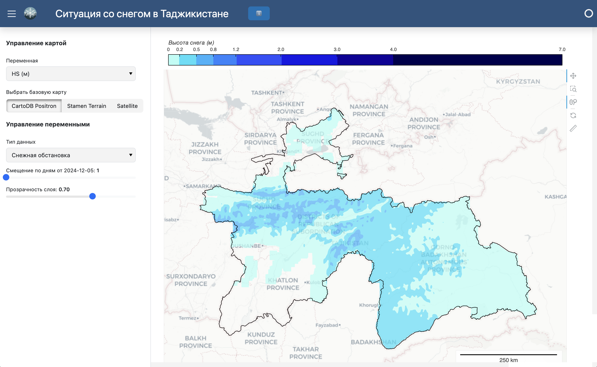

 [](https://github.com/hydrosolutions/taj_snowmapper_dashboard/blob/main/LICENSE) [](https://www.python.org/downloads/release/python-311/) [](https://github.com/hydrosolutions/taj_snowmapper_dashboard/commits/main)

## Snowmapper Tajikistan
This repository contains the code for the snowmapper tajikistan dashboard, currently available under [taj.snowmapper.ch](https://taj.snowmapper.ch/snowmapper). The dashboard is a web application that displays snow cover data for Tajikistan. The data is sourced from the [snowmapperForecast](https://github.com/joelfiddes/snowmapperForecast) model implemented by [Joel Fiddes]([@joelfiddes](https://github.com/joelfiddes)).

Below we show a screenshot of the dashboard displaying a forecast of snow heigth:


## Architecture
This project comes in 2 components: A data processor and a web interface. The data processor is a python script that downloads the latest snow data from the TopoPyScale and FSM model and, after pre-processing, stores it in local files optimized for display. The web interface is a dashboard that displays the snow-related data on a map. Both components are run in a docker container.

### Data Processor
The data processor is a python script that downloads the latest snow data from the TopoPyScale and FSM model and stores it in local files optimized for display. The data processor is run as a cron job that runs every day around 21:00 UTC. It further removes the old data and keeps only the latest data on the server. Data processing can take several minutes, requires a stable internet connection, and a server with sufficient memory resources (we recommend at least 8 GB RAM).

### Web Interface
The web interface is a web application that displays the snow-related data on a map. The web interface is built using the Holoviews and Bokeh libraries and the Panel dashboard library. It is run as a web server that serves the web application. The web interface is run as a docker container that is started when the server is started.

## Deployment Instructions
### Requirements
- Ubuntu 20.04 LTS
- Storage: 24 GB
- Memory: 8 GB
- Docker engine (Docker version 27.1.2 or higher) [Installation instructions](https://docs.docker.com/engine/install/ubuntu/)
- git (git version 243 or higher) (Installation: `sudo apt-get install git`)

Note: The installation of Docker Engine alone requires 2 GB, each docker image will require close to 2 GB and the caching of netCDF files will require another 2 GB of free storage.

Note: This implementation of the dashboard is configured with Nginx Proxy Manager for reverse proxy setup and SSL termination. If you want to deploy the dashboard under a diffent URL, you will need to edit the `Dockerfile` according to the instructions there and re-build the dashboard image.
Alternatively you can manually configure Nginx reverse proxy on your server. Contact your IT department for help if you are not familiar with this.

Note: This repository assumes that you have access to a server instance running the operational [snowmapperForecast](https://github.com/joelfiddes/snowmapperForecast) model. Concretely you need to have access to the .pem file that allows you to download the snow data from the model.

### Deployment steps
#### Clone GitHub repository
Clone the GitHub repository
```bash
git clone <repo-url>
```

Change to the repository directory
```bash
cd taj_snowmapper_dashboard
```

#### Set environment variables
Edit the `.env` file and set the required environment variables.
```bash
vi .env
```

Copy the .pem file to the server running the snowmapperForecast model operationally and set the path to the .pem file in the .env file relative to the folder /app/processing.

#### Configure language settings
The dashboard is currently configured to display strings in Russian language. However, you can change to English by editing the `default_language` variable in the `config/config.base.yaml` file and by editing the `figure_title` and `units` variables in the same file.

#### Pull and test-run the docker containers
This GitHub repository uses GitHub Actions to build docker containers and to upload them to DockerHub. To deploy the dashboard, you can now simply run a bash script that pulls the processing docker image and runs it in a container. From the root directory of the repository, run the following command:
```bash
bash run_data_processor.sh
```
This script will thake a few minutes to run. You can see if it was successful by checking the logs and the files in the `data` folder.

After editing the dashboard to run on your preferred url, you can test-run the web interface with the following docker pull and docker compose commands:
```bash
docker pull mabesa/taj-snowmapper-dashboard
docker compose up -d
```

#### Operationalize the data processor
Define regular cron jobs
```bash
crontab -e
```

Add the following line to the crontab file to periodically run the data processor at 21:09 UTC time which is around 2 o'clock in the moring in Dushanbe.
```bash
9 21 * * * bash ~/taj_snowmapper_dashboard/run_data_processor.sh >> ~/taj_snowmapper_dashboard/logs/crontab_processor.log 2>&1
```

And add the following line to the crontab file to periodically restart the web interface at 2:00 UTC
```bash
9 22 * * * docker restart taj-snowmapper-dashboard >> ~/taj_snowmapper_dashboard/logs/crontab_dashboard.log 2>&1
```


